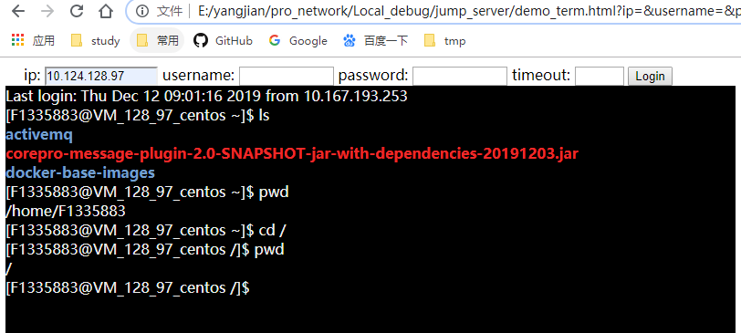

### 防止同页面同ip两次login，前面打开的websocket一直保持在后台运行占用资源  
打开ssh登录页面时cookie传入用户信息,src ip 信息；后台检测新的websocket请求是否与前请求重复，重复则断开前请求    
后台判断重复则关闭前打开的websocket：websocket.close()    

### 已完成状态展示：  
    

可用平台： 自动化平台，运维管理平台等    